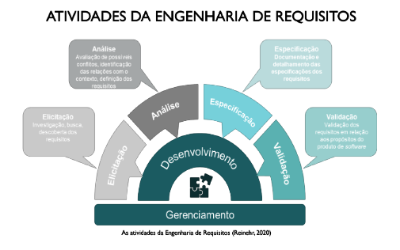
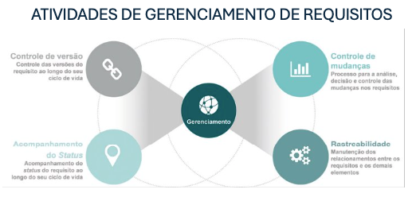
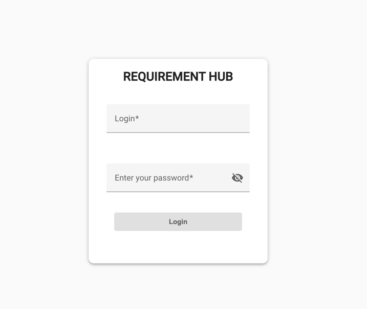

<h1 align="center">
    Requirement Hub API
</h1>

```javascript

Autores: 'Johnny Carvaho' - 'Lucas Lemes' - 'Elias Coutinho'
Date: 2024
```
## Redes socais

* [Linkedin Johnny Carvalho](https://www.linkedin.com/in/johnny-carvalho-em/)
* [Linkedin Lucas Lemes](https://www.linkedin.com/in/lucas-lemes-da-silva-19a91b148/)
* [Linkedin Elias Coutinho](https://www.linkedin.com/in/eliasfernandescout/)

## Principais tecnologias utilizadas: <br/>
<p>
    <li> - Java</li><br>
    <li> - Spring</li><br>
    <li> - Postgres SQL</li><br>
    <li> - Maven</li><br>
    <li> - Postman</li><br>
    <li> - JUnit 5</li><br>
    <li> - Swagger</li><br>
    <li> - Docker</li><br>
    <li> - AWS</li><br>
</p>

## Resumo do projeto

A proposta da plataforma apresenta-se como um Sistema de Gerenciamento de Requisitos de Software e será desenvolvida para lidar com os desafios frequentes durante o ciclo de vida do desenvolvimento de software.
Com funcionalidades cruciais, como o registro de projetos, o controle de acesso, cadastro de requisitos e histórico de mudanças, a ferramenta visa simplificar os processos de elicitação, especificação, validação e gerenciamento de requisitos,
buscando otimizar a gestão de requisitos de forma mais organizada e transparente, mantendo um histórico completo de atividades. O foco dessa plataforma reside no processo de gerenciamento de requisitos, a rastreabilidade de requisitos e gerenciamento de
mudanças com um diferencial que será a implementação de uma Matriz de Rastreabilidade de Requisitos. Esta característica possibilita a visualização e análise das inter-relações entre os requisitos, proporcionando uma compreensão mais aprofundada e facilitando a tomada de
decisões estratégicas ao longo do ciclo de vida do desenvolvimento de software. Com essa funcionalidade, a plataforma não apenas organiza e permite validação de requisitos, mas também oferece entradas valiosas para o sucesso do projeto. Ao introduzir a Matriz de Rastreabilidade de Requisitos
como uma solução inovadora para esse problema central, a plataforma não apenas visa fornecer as funcionalidades essenciais de um Sistema de Gerenciamento de Requisitos, mas também busca lidar com a questão das mudanças nos requisitos. A rastreabilidade de requisitos permite
rastrear como os requisitos estão inter-relacionados e como mudanças em um requisito afetam outros requisitos e o produto de software. Portanto, a plataforma não apenas facilita a gestão e compreensão dos requisitos, mas também ajuda a gerenciar eficientemente as mudanças, melhorando assim a
qualidade do software entregue. Apresentamos na revisão de literatura acontecimentos marcantes que evidenciam a importância da Engenharia de Requisitos no ciclo de vida de um projeto de software.




## Possíveis status das etapas do projeto
####
 - Em andamento.<br><br>
 - Pendente.<br><br>
 - Concluído.

## Requisitos do projeto
### Etapa I
* RF-01: Cadastro de projetos - 
* RF-03: Login de membros do projeto - 
* RF-04: Controle de acesso - 
* RF-05: Área inicial com projetos em andamento - 
* RF-06: Cadastro de requisitos - 
* RF-08: Cadastro de artefatos, módulos e documentos - 
* RF-09: Associação de requisitos com artefatos, módulos e documentos - 
* RF-10: Visualização das associações dos requisitos - 
* RF-13: Especificação dos requisitos - 
* RF-19: Criação de matriz de rastreabilidade de requisitos - 
* RF-22: Upload de arquivos de projeto - 
* RF-23: Download de arquivos de projeto - 

### Etapa II
* RF-02: Cadastro de membros do projeto - 
* RF-07: Classificação e organização dos requisitos - 
* RF-11: Revisões dos requisitos - 
* RF-12: Associação de requisitos a usuários ou partes interessadas - 
* RF-14: Validação dos requisitos - 
* RF-15: Validação de artefatos, módulos e documentos - 
* RF-16: Versionamento dos requisitos - 
* RF-17: Registro de mudanças nos requisitos - 
* RF-18: Visualizações de status dos requisitos - 
* RF-20: Deleção de projetos para administradores - 
* RF-21: Deleção de integrantes de projetos para administradores - 

### Etapa III
* RNF-01: Fazer o deploy da aplicação em um ambiente de produção - 
* RNF-02: Criar a documentação do projeto - 
* RNF-03: Criar testes de unidade e integração - 
* RNF-04: Criar testes de usabilidade - 

## Como executar o projeto

### Back End
Para que o código funcione corretamente deve-se ser instalados as seguintes ferramentas:
- JDK em [Java Downloads | ORACLE](https://www.oracle.com/br/java/technologies/downloads/)
- Um compilador "recomendamos IntelliJ" em [IntelliJ IDEA: The Java IDE for Professional Developers by JetBrains](https://www.jetbrains.com/idea/download/#section=windows)
- PostgreSQL em [PostgreSQL | Downloads](https://www.postgresql.org/download/)
- Postman em ou similar [Postman | Download Postman App](https://www.postman.com/downloads/)

### Front End
- O front-end está localizado no seguinte repositório [Requirement Hub UI](https://github.com/Trabalhos-universitarios/Requirement-Hub-UI)
  lá encontrará um passo a passo de como executar o projeto.

## Passos executar projeto
Próximo passo agora é configurar o arquivo ``application.properties`` com as informações do seu banco de dados, para isso, abra o arquivo e altere as seguintes linhas de acordo com as informações do seu banco de dados:
````java
spring.datasource.url=jdbc:postgresql://endereco_do_seu_banco:porta/nome_do_seu_banco
spring.datasource.username=//seu_usuario
spring.datasource.password=//sua_senha
````
Feito isso, agora é rodar o projeto spring e acessar o seguinte endereço no seu postman:
````
http://localhost:8080
````
Com isso, você poderá acessar o sistema e realizar as funcionalidades disponíveis.

### Criando usuário e senha via postman
Para criar um usuário e senha não é possível via postman, é necessário criar um usuário e senha manualmente no banco de dados, para isso, siga os seguintes passos:
1. Abra o banco de dados e acesse a tabela ``users``.
2. Clique em ``Insert`` e insira um novo usuário e senha.
3. Clique em ``Apply`` e a alteração será salva.
4. Pronto, usuário e senha criados com sucesso. 
 Se preferir, poder usar o seguinte script para criar um usuário e senha:
 ````sql
INSERT INTO public."_user"
  (id, "name", "password", "role", username, image)
VALUES(nextval('_user_id_seq'::regclass), '', '', 0, '', '');
````

### Fazer login via postman e recuperar o token JWT
Para fazer login via postman e recuperar o token JWT, siga os seguintes passos:
1. Abra o postman e crie uma nova requisição do tipo ``POST``.
2. No campo de URL, insira o seguinte endereço: ``localhost:8080/auth/authenticate``.
3. No campo de body, selecione a opção ``raw`` e insira o seguinte JSON:
````json
{
    "username": "username",
    "password": "password"
}
````
4. Clique em ``Send`` e a requisição será enviada.
5. Pronto, você receberá um token JWT como resposta. 

Ou se preferir pode logar direto pelo front-end, para isso, siga os seguintes passos:

1. Su a aplicação back-end já estiver rodando, execute a aplicação front-end Angular confi=orme passo a passo no repositório [Requirement Hub UI](https://github.com/Trabalhos-universitarios/Requirement-Hub-UI)
2. Abra o front-end no andereço ``http://localhost:4200`` e clique em ``Login``.
2. Insira o usuário e senha criados anteriormente.
3. Clique em ``Login`` e pronto, você estará logado no sistema. 

### Tela de login front-end


## Regras de acesso
O sistema permite o acesso de 4 tipos de usuário, são eles:
* Administrador - tem acesso total ao sistema
* Gerente de projeto - tem acesso total ao(s) projeto(s) relacionado
* Membro de projeto - tem acesso parcial ao(s) projeto(s) relacionado
* Usuário comum - tem acesso limitado ao(s) projeto(s) relacionado

Roles:
* 0 - Gerente de projeto
* 1 - Analista de requisitos
* 2 - Analista de negócios
* 3 - Usuário comum (Ex developer, tester, etc)
* 4 - Administrador

## Prmissões por Role
* Administrador - tem acesso a todos os projetos e pode criar, deletar e editar qualquer usuário do sistema
* Gerente de projeto - tem acesso aos projetos relacionados a ele, poder ceir projetos, cadastrar membros e gerenciar os membros do projeto dentre outras funcionalidades voltadas a projeto, como aprovar ou rejeitar um requisito.
* Analista de requisitos - tem acesso aos projetos relacionados a ele, poder cadastrar requisitos, artefatos, módulos, documentos, validar requisitos, revisar requisitos, não pode aprovar requisitos.
* Analista de negócios - tem acesso aos projetos relacionados a ele, com acessos limitados.
* Usuário comum - tem acesso aos projetos relacionados a ele, com acessos limitados.

## Regras de negócio
As regras de negócio do projeto estão localizadas no seguinte diretório: ``src/main/java/com/requirementhub/business``.
Lá você encontrará todas as regras de negócio implementadas no projeto, como mais detalhes das regras de acesso.


### Documentação da API
A documentação da API pode ser acessada através do Swagger após a api já estar rodando, no seguinte endereço:
````
http://localhost:8080/swagger-ui.html
````
``OBS:`` Para acessar a documentação da API é necessário com a api rodando na mesma porta, ou seja, se a api estiver
rodando na porta ``8080``, a documentação estará disponível no endereço ``http://localhost:8080/swagger-ui.html``.

## Acessar o sistema
Se já tiver cadastrado usuário e senha, é só logar e acessar o sistema, caso contrário
contate o administrador do sietema para que seja atribuído ao usuário um usuário e senha.

## Considerações finais

Este projeto foi desenvolvido como uma ferramenta de apoio ao gerenciamento de requisitos de software, integrando nosso Trabalho de Conclusão de Curso (TCC). Baseado em uma revisão de literatura, identificamos os principais desafios no gerenciamento de requisitos, e a partir deles, definimos os requisitos do sistema, que foram implementados ao longo do desenvolvimento.

Utilizamos a metodologia ágil com sprints para organizar o desenvolvimento. Ao final de cada sprint, realizamos revisões e ajustes conforme necessário. O controle de versão foi gerenciado com Git e GitHub, e cada nova versão do código recebeu uma tag, facilitando o rastreamento de versões.

Para garantir a execução em múltiplos ambientes, empregamos Docker, criando um container com todas as dependências necessárias para o projeto. O sistema foi hospedado na AWS, usando uma instância EC2, permitindo acesso remoto ao projeto a qualquer momento. Automatizamos o processo de deploy usando GitHub Actions, que, a cada nova versão, construía e implantava o projeto na EC2, simplificando o ciclo de implantação.

O front-end foi desenvolvido em Angular, onde foram criadas as interfaces e implementadas as funcionalidades do sistema. O back-end foi construído com Spring Boot, criando os endpoints e implementando as regras de negócio. Usamos o banco de dados PostgreSQL para armazenar as informações, com JPA facilitando o acesso e manipulação dos dados.

Por fim, o Swagger foi utilizado para documentar os endpoints, garantindo clareza e fácil compreensão das APIs desenvolvidas.

Agradecimentos a universidade PUCPR e aos professores envolvidos nesse projeto, agradecimentos  a nossa orientadora

* Mestre Rosilene Fernandes [Currículo Lattes](http://lattes.cnpq.br/4623895434431376).

Queremos também deixar nosso agradecimento a banca que avaliou nosso trabalho

* Doutora Sheila dos Santos Reinehr [Currículo Lattes](http://lattes.cnpq.br/8130292521370915)
* Doutora Regina Fábia Lopes de Albuquerque [Currículo Lattes](http://lattes.cnpq.br/1874995247816757)
* Mestre Tiago Adelino Navarro [Currículo Lattes](http://lattes.cnpq.br/9454143758427870)


